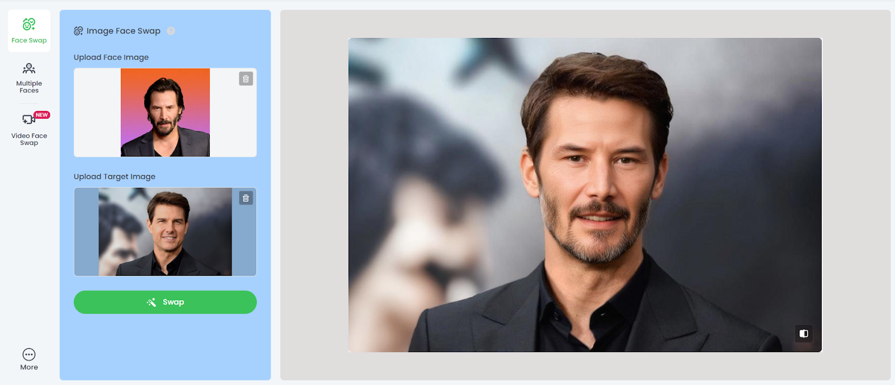

# 🎭 Headswap AI – Real-Time Face Integration Technology

**Headswap AI** is an advanced tool that seamlessly integrates faces into video content in real-time, offering **unprecedented levels of personalization and engagement** for content creators, influencers, and digital storytellers.

This technology **eliminates reshoots and additional cast**, enabling creators to produce dynamic, engaging content quickly and cost-effectively.

---

## Examples

<table>
    <tbody>
        <tr>
            <td width="50%">
                
            </td>
            <td width="50%">
                
            </td>
        </tr>
        <tr>
            <td width="50%">
                
            </td>
            <td width="50%"></td>
        </tr>
    </tbody>
</table>

<table>
    <tbody>
        <tr>
            <td width="33.3333%">
                
            </td>
            <td width="33.3333%">
                
            </td>
            <td width="33.3333%">
                
            </td>
        </tr>
        <tr>
            <td width="33.3333%">
                
            </td>
            <td width="33.3333%">
                
            </td>
            <td width="33.3333%">
                
            </td>
        </tr>
        <tr>
            <td width="33.3333%">
                
            </td>
            <td width="33.3333%">
                
            </td>
            <td width="33.3333%">
                
            </td>
        </tr>
    </tbody>
</table>

<table>
    <tbody>
        <tr>
            <td width="50%">
                <video src=" " controls preload>
                    Your browser does not support the video tag.
                </video>
            </td>
            <td width="50%"></td>
        </tr>
    </tbody>
</table>

---

## 📊 Full Description

  
📖 Click to expand the Description

## 🎬 Overview
In today’s fast-paced digital media landscape, content creators are challenged to produce varied, engaging videos **under tight deadlines and limited resources**.

**Headswap AI** addresses this by allowing **real-time face integration** into videos, maintaining **high realism** while offering creative flexibility and efficiency.

---

## ❌ Problem
- Traditional content creation is **time-consuming and expensive**.
- Reshoots, costume changes, and additional cast **limit content diversity**.
- Continuous creative innovation is **stifled by logistical and financial constraints**.
- Influencers need **fast, flexible, and realistic content creation tools**.

---

## ✅ Solution
- Real-time face mapping and integration using AI
- Maintains facial expressions, movements, and lighting
- Fast, cost-effective, and accessible
- Flexible content adaptation for **storytelling and personalization**
- Seamless integration into video pipelines for **professional-quality output**

---

## 🛠️ Process

### 1️⃣ Data Collection & Preprocessing
- Thousands of facial images across **ethnicities, ages, and expressions**
- Variations in lighting, angles, and obstructions
- Face detection with **Haar Cascade Classifier**
- Landmark detection using **Dlib**
- Alignment and cropping for training

### 2️⃣ Model Training & Architecture
- **Generative Adversarial Network (GAN)** using **First Order Motion Model**
- Generator predicts target face with motion from driving video
- Discriminator evaluates realism
- Custom loss function for **identity preservation and motion transfer**

### 3️⃣ Real-Time Processing & Optimization
- **Model pruning, quantization**, and efficient convolutions
- NVIDIA **TensorRT** for accelerated inference
- Real-time performance: **30 fps on consumer GPUs, 60 fps on high-end GPUs**

### 4️⃣ Video Processing Pipeline
- Detect and track faces in video frames using **SSD + custom tracking algorithm**
- Process frames through trained GAN
- Reassemble video seamlessly

### 5️⃣ Post-Processing & Quality Enhancement
- Color correction for **skin tone matching**
- Edge smoothing to remove artifacts
- Temporal consistency using **optical flow**

---

## 🏆 Achievements
- ⏱️ **Real-time performance** at 30–60 fps
- 💾 **40% reduction** in model size without quality loss
- 🎯 **95% accuracy** in facial expressions and head movements
- 🌍 Dataset: **10,000+ images** across diverse demographics
- 📈 **20,000+ personalized videos** created within six months
- Integrated into **3 leading content creation platforms**

---

## 🔮 Future Improvements
- **User Interface Development** for non-technical users
- Enhanced **model generalization** for extreme expressions, angles, and lighting
- Further reduction in **processing time**
- **High-resolution support** (4K output)
- **Ethical safeguards** for deepfake detection and watermarking
- Real-time streaming integration for **live broadcasting and video conferencing**

---

## 🧰 Resources
- First Order Motion Model for Image Animation – Aliaksandr Siarohin et al.
- Generative Adversarial Networks – Ian Goodfellow et al.
- Improving the Realism of Synthetic Images – Apple Inc.
- Deep Learning for Computer Vision: A Brief Review – Geoffrey Hinton et al.
- Efficient Object Detection – Ross Girshick et al.
- Real-time Super-Resolution Using Sub-Pixel CNN – Wenzhe Shi et al.
- DeepFake Survey – Yisroel Mirsky, Wenke Lee
- Face Detection with Faster R-CNN – Shaoqing Ren et al.

